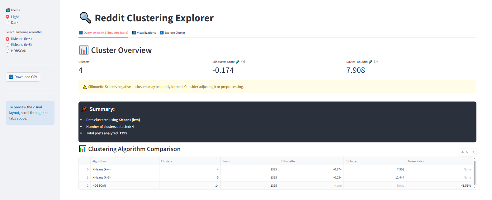
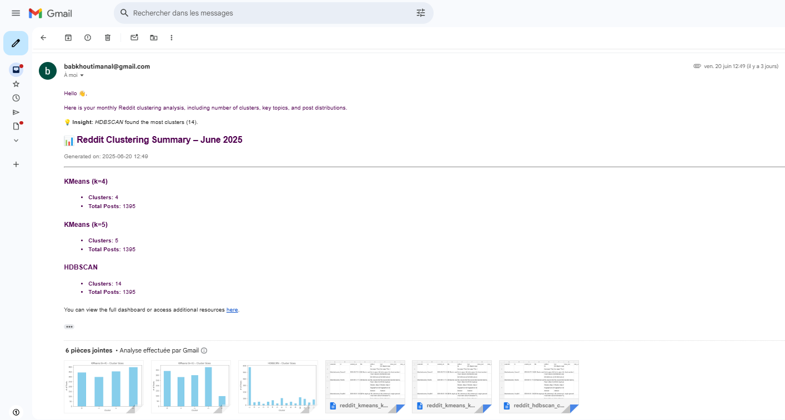

# 🧠 Reddit Topic Explorer — Market Intelligence from Online Communities

> A semi-automated, end-to-end NLP pipeline that extracts, clusters, and visualizes trending AI topics from Reddit using sentence embeddings, unsupervised clustering (KMeans + HDBSCAN), and an interactive Streamlit dashboard.

---

## 💼 Business Use Case

"Reddit Topic Explorer" provides a prototype for how **marketing teams, product strategists, researchers**, and **investors** can monitor and analyze Reddit discussions around AI and machine learning:

- 📈 **Trendspotting**: Identify what users are talking about, what's emerging, and what’s losing interest.
- 🧭 **Market Mapping**: Cluster organic discussions to understand different AI subdomains (LLMs, MLOps, tools, ethics, etc.).
- 💬 **Content Mining**: Extract meaningful keywords and themes using unsupervised methods.
- 🧠 **Insight Delivery**: Package findings visually and optionally send email summaries to stakeholders.

It’s especially useful for:
- Venture capital scouting early signals
- Product teams tracking community feedback
- AI startups doing market positioning
- Analysts exploring niche interests in tech forums

---

## 🚀 Pipeline Overview (Modular & Reproducible)

| Step | Component                        | Purpose                                                                 |
|------|----------------------------------|-------------------------------------------------------------------------|
| 1️⃣   | `fetch_data.py`                | Use PRAW to scrape long-form posts from selected AI-related subreddits |
| 2️⃣   | `clean_data.py`                | Clean, normalize, remove noise, and prepare text for modeling          |
| 3️⃣   | `encode_text.py`               | Generate sentence-level embeddings using `MiniLM` transformer          |
| 4️⃣   | `extract_keywords.py`          | Extract top keywords per post using KeyBERT (cosine similarity method) |
| 5️⃣   | `cluster_kmeans.py`            | Apply KMeans, compute Silhouette Score, visualize elbow & clusters     |
| 6️⃣   | `cluster_hdbscan.py`           | Use HDBSCAN for density-based clustering with noise/outlier detection  |
| 7️⃣   | `add_pca_coordinates.py`       | Run PCA to reduce embeddings to 2D for scatter plots                   |
| 8️⃣   | `app.py`                       | Streamlit dashboard for filtering, keyword browsing, topic exploration |
| 9️⃣   | `email_dispatcher.py`          | Optional: send summaries of cluster results by email (via SMTP)        |
| 🔬    | `clustering_analysis_.ipynb`   | Extra insights: cluster quality, keyword coherence, comparisons        |

---

## 🧠 Scientific Choices & Rationale

- **Sentence Embeddings (MiniLM)**: Balanced between speed and semantic richness, MiniLM lets us represent posts in vector space for clustering.
- **Keyword Extraction (KeyBERT)**: Uses transformer similarity to pull contextually relevant terms (not just frequent words).
- **KMeans**: Good for structured, quick clustering; we tune `k` with elbow and silhouette score.
- **HDBSCAN**: Excels at detecting noise and irregular cluster shapes — more realistic for Reddit's messy, organic data.
- **PCA**: Helps reduce high-dimensional embeddings to 2D while preserving structure for scatter plot visualization.
- **Streamlit**: Chosen for interactive UX, easy exploration, and fast deployment.
- **Email Summary**: Scripted email reports allow optional stakeholder updates with keyword summaries.

---

## 📁 Folder Structure

```
.
├── fetch_data.py
├── clean_data.py
├── encode_text.py
├── extract_keywords.py
├── cluster_kmeans.py
├── cluster_hdbscan.py
├── add_pca_coordinates.py
├── app.py
├── email_dispatcher.py
├── clustering_analysis_.ipynb
├── requirements.txt
├── dockerfile
├── .env.example
├── .gitignore
└── data/
    ├── reddit_raw.csv
    ├── reddit_clean.csv
    ├── reddit_embeddings_clean.npy
    ├── reddit_kmeans_k4_clusters.csv
    ├── reddit_kmeans_k5_clusters.csv
    ├── reddit_hdbscan_clustered.csv
    ├── elbow.jpg
    ├── kmeans_k4.jpg
    ├── kmeans_k5.jpg
    ├── hdbscan.jpg
```

---

## ⚙️ How to Run Everything (FULL PIPELINE)

### 1. 🔧 Install dependencies
```bash
git clone https://github.com/your/reddit-topic-explorer.git
cd reddit-topic-explorer
cp .env.example .env
pip install -r requirements.txt
```

### 2. 🔁 Run full pipeline step-by-step
```bash
python fetch_data.py           # Pull Reddit posts (PRAW)
python clean_data.py           # Clean & normalize
python encode_text.py          # Embed with MiniLM
python extract_keywords.py     # Keyword extraction (KeyBERT)
python cluster_kmeans.py       # KMeans clustering + visuals
python cluster_hdbscan.py      # HDBSCAN clustering + visuals
python extract_keywords.py     # Keyword extraction (KeyBERT)
python add_pca_coordinates.py  # For dashboard visual scatter
```

### 3. 🧪 Explore clusters in the notebook
Open `clustering_analysis_.ipynb` for:
- Cluster samples
- Keyword coherence checks
- Dimensionality sanity checks

### 4. 📊 Launch Streamlit dashboard
```bash
streamlit run app.py
```

Use the dashboard to:
- Filter posts by cluster or keywords
- Explore PCA scatter
- Dive into each cluster’s topic

### 5. 📬 Send summary by email (optional)
```bash
python email_dispatcher.py
```

Your `.env` must include SMTP credentials:
```
REDDIT_CLIENT_ID=your_id
REDDIT_CLIENT_SECRET=your_secret
REDDIT_USERNAME=your_username
REDDIT_PASSWORD=your_password
REDDIT_USER_AGENT=reddit-topic-explorer

EMAIL_HOST=smtp.example.com
EMAIL_PORT=587
EMAIL_USER=your@email.com
EMAIL_PASS=your_password
EMAIL_TO=recipient@email.com
```

## 🖥️ App Preview





---

## 📸 Sample Visuals (Saved to `/data`)

- `elbow.jpg` — Optimal number of clusters (KMeans)
- `kmeans_k4.jpg` / `kmeans_k5.jpg` — Cluster scatter plot
- `hdbscan.jpg` — Density-based clustering view

You can view these in the notebook or dashboard.

---

## 🧩 Ideas for Extensions

- Sentiment analysis of each cluster
- Live streaming pipeline (Reddit → Kafka → Dashboard)
- Topic modeling with LDA or BERTopic
- Multilingual support + translation
- Save interactive views as PDF reports
- Hugging Face Spaces / Streamlit Cloud deployment

---

## 🛠️ Technologies Used

Built with:
- 🤖 `sentence-transformers`
- 🔍 `KeyBERT`
- 📊 `scikit-learn`, `HDBSCAN`, `PCA`
- 🧼 `NLTK`, `re`
- 🚀 `Streamlit`
- 🐍 `PRAW` (Python Reddit API Wrapper)

---

## ✨ Final Thoughts

This project combines **language modeling, unsupervised learning**, and **interactive visualization** in a pipeline that is technically sound and shows strong potential for exploratory insight discovery in real-world datasets like Reddit.
