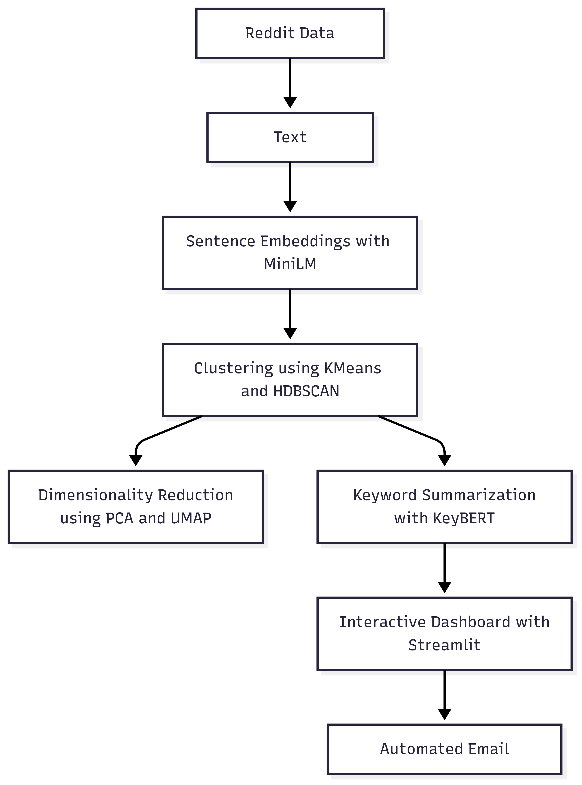
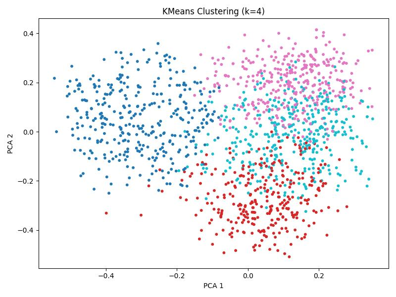
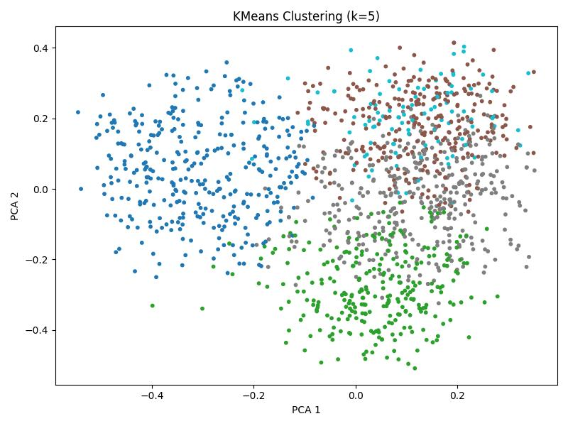
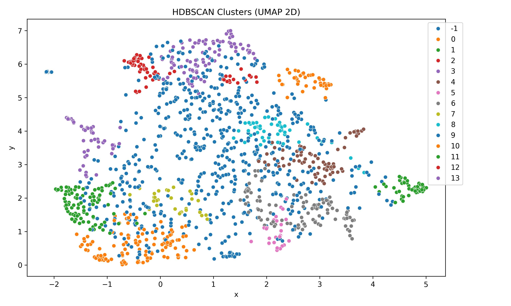
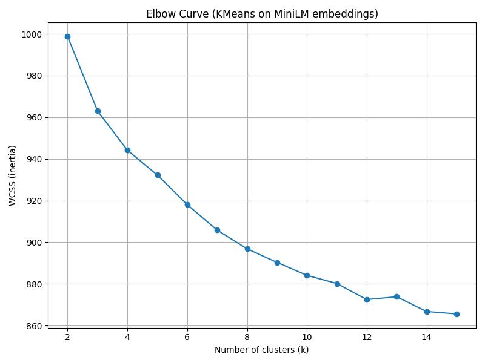
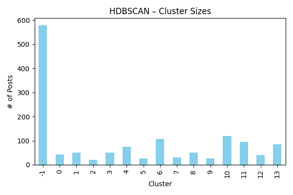
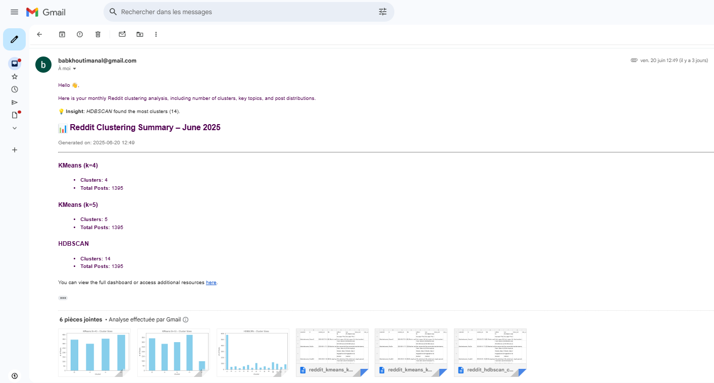
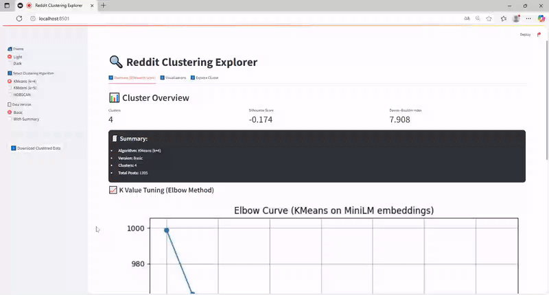

# 🔎 Reddit Topic Explorer

**Reddit Topic Explorer** is an end-to-end NLP project designed to cluster Reddit posts using semantic embeddings and unsupervised learning. It lets users interactively explore trending topics, discover latent themes, and gain insights from massive Reddit datasets.

This project combines modern NLP, clustering, and visualization techniques into a clean pipeline and dashboard — making it ideal for content exploration, community analysis, or automated topic tracking.
 
### 🚀 Why this project matters

- 📌 **Content Discovery**: Easily uncover emerging or hidden discussion themes in any subreddit or large corpus.
- 📊 **Marketing & Trend Analysis**: Useful for brands, researchers, and analysts looking to spot trends or analyze sentiment.
- 🧠 **Intelligent Summaries**: Each topic is automatically summarized with key keywords extracted using transformer-based models.
- 🧪 **Robust ML Pipeline**: From preprocessing and embedding to clustering and summarization, the whole stack is modular and production-ready.
- 📬 **Email Reports**: Get clean digest-style topic summaries directly via email — ideal for monitoring.

---


## ✨ Features

- 🔍 **Multi-Algorithm Clustering** — Explore both KMeans (k=4, k=5) and HDBSCAN clustering results
- 🧠 **Dimensionality Reduction** — Visualize data in 2D using PCA
- 🌐 **Interactive Cluster Exploration** — Select clusters, filter by keywords, and browse actual Reddit posts
- ☁️ **Word Clouds** — Automatically generated per cluster for quick thematic insights
- 📝 **Post Summaries & Highlights** — Each post is accompanied by a brief summary and key keywords for quick understanding.
- 📊 **Cluster Metrics** — View Silhouette Score, Davies–Bouldin Index, and noise ratio (for HDBSCAN)
- 📈 **Elbow Method Chart** — Precomputed K tuning plot for KMeans
- 🌓 **Dark/Light Theme Toggle** — Choose between sleek dark mode and classic light
- 📁 **Downloadable Outputs** — Export clustered datasets as CSV for further analysis

## 🧪 How It Works

This project takes Reddit post data and transforms it into a fully interactive topic exploration tool using clustering and natural language processing. Here's the pipeline:

1. **📥 Data Collection**  
   Raw Reddit post texts are gathered and preprocessed for analysis (cleaning, lowercasing, etc.).

2. **🔤 Text Embedding**  
   Posts are converted into numerical vectors using **MiniLM** sentence embeddings for capturing semantic similarity.

3. **📉 Dimensionality Reduction**  
   The high-dimensional embeddings are reduced to 2D with **PCA**, enabling visualization and clustering.

4. **🧩 Clustering**  
   - **KMeans** is used with preselected values of *k* (4 and 5), offering interpretable, fixed clusters.  
   - **HDBSCAN** detects variable-density clusters and flags noise (outliers) automatically.

5. **📋 Cluster Summaries**  
   For each cluster, we extract representative **keywords** to describe its main themes.

6. **🎨 Visualization App**  
   The app allows users to:
   - Explore cluster-level metrics (e.g., Silhouette score, noise ratio)
   - View PCA visualizations and word clouds
   - Dive into sample posts with auto-highlighted keywords
   - Filter by keywords and navigate through post pages
   - Switch between **basic** and **summary-enhanced** data versions
   - Download clustered data

7. **🌓 UI Features**  
   Built with **Streamlit**, the app includes a responsive layout, dark/light themes, sidebar controls, and expandable filters.

## 📌 Project Pipeline & Visual Insights

This project follows a structured, real-world pipeline from data acquisition to insightful visualization and automated summarization:


#### 🔄 End-to-End Pipeline Overview



## 📊 Visualizations & Results

#### 📍 Cluster Visualization: KMeans (k=4)


#### 📍 Cluster Visualization: KMeans (k=5)


#### 📍 Cluster Visualization: HDBSCAN + UMAP


#### 📈 Elbow Plot for K Tuning



## 📉 Cluster Summary Snapshots

### 🧠 HDBSCAN Topic Summary


### 🧠 KMeans Topic Summary (k=4)


### 🧠 KMeans Topic Summary (k=5)


## 🖥️ Interactive Dashboard & Email Report

The project includes an intuitive Streamlit app with multiple exploration tabs and filtering options, allowing users to visually inspect clusters, word clouds, and sample posts interactively. It also features an automated **email digest** summarizing key insights.

### 📊 Dashboard Interface


### 📬 Daily Email Summary



## ⚙️ Project Setup & Requirements

This project runs as a full Python + Streamlit app. You’ll need to clone the repo, install the dependencies, and run the app locally.

---

### 🔧 1. Install Dependencies

Create a virtual environment (optional but recommended):

```bash
python -m venv .venv
source .venv/bin/activate  # On Windows: .venv\Scripts\activate
```

Install required packages:

```bash
pip install -r requirements.txt
```

Or install manually:

```bash
pip install pandas numpy matplotlib seaborn scikit-learn streamlit wordcloud
```

---

### ▶️ 3. Run the App

Start the Streamlit app locally:

```bash
streamlit run app.py
```

Then open your browser at: [http://localhost:8501](http://localhost:8501)

## 🧠 Technical Insights & Design Decisions

### 🔤 Why MiniLM for Embeddings?
We chose **MiniLM** as the sentence embedding model for its excellent trade-off between **semantic richness and speed**. Unlike traditional TF-IDF or even older transformers, MiniLM captures contextual meaning while remaining lightweight enough for large-scale processing. It was especially useful for embedding tens of thousands of Reddit posts quickly without GPU dependency.

### 🔍 Why Use Both KMeans and HDBSCAN?
We implemented **both** clustering algorithms to showcase their strengths:
- **KMeans** provides clean, fixed-size clusters and is ideal when the number of clusters is known or can be estimated (via Elbow method).
- **HDBSCAN** is density-based and excels at discovering clusters of varying shapes and densities, while also identifying noise (outliers) — making it more robust in unsupervised settings.

Including both gives users flexibility and allows comparison of cluster quality.

### 🌗 Why a Basic/Summary Toggle?
Some users prefer a **raw, unprocessed view** of the posts (basic), while others benefit from **summary-enhanced data**, which includes extracted keywords for faster interpretation. The toggle lets the user decide the experience — helping both casual exploration and analytical insight.

### ✨ Keyword Highlighting in Posts
To improve post readability, the app highlights:
- **User-provided keywords** in a distinct color
- **Auto-generated summary keywords** using KeyBERT or similar tools

These highlights help users quickly identify the **most relevant parts** of a post without reading everything line-by-line — improving topic scanning and content understanding.

## 🎥 Demo

Here's a quick preview of the Streamlit app in action:


